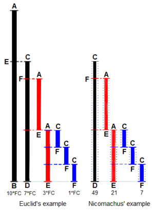

# Chapter 1 - Basic Concepts  
## 1.1 Algorithms  
This chapter uses Euclid's algorithm as an example to get the reader familiar about various terminologies used in the book. Apart from that, introductory discussions are present in the chapter which are best enjoyed from the book. Here is the gist of only important "technical" parts from the topic 1.1

>### Algorithm E (Euclid's algorithm)  
>  
>Given two positive integers m and n, find their **greatest common divisor**, that is the largest positive integer that evenly divides both m and n.    
>  
>E1. [Find remainder.] Divide m by n and let r be the reminder. (We will have 0 &#8804; r &#8804; n.)    
>E2. [Is it zero?] If r = 0, the algorithm terminates; n is the answer.    
>E3. [Reduce.] Set m &larr; n, n &larr; r, and go back to step E1.    

### Trace of algorithm E for m = 544, n = 119  

- E1. m = n * q + r; q = 4, r = 68;  
- E2. r = 68 &ne; 0;  
- E3. m = 119, n = 68; go to E1;  
- E1. m = n * q + r; q = 1, r = 51;  
- E2. r = 51 &ne; 0;  
- E3. m = 68, n = 51; go to E1;  
- E1. m = n * q + r; q = 1, r = 17;  
- E2. r = 17 &ne; 0;   
- E3. m = 51, n = 17; go to E1;  
- E1. m = n * q + r; q = 3, r = 0;  
- E2. r = 0; terminate algorithm; **Ans: 17**  
  
### Intution for Algorithm E:   

  

source: [wikipedia article on Euclidean Algorithm](https://en.wikipedia.org/wiki/Euclidean_algorithm)    

Dividing AB with CD gives AE as reminder.   
Dividing CD with AE gives CF as reminder.  
AE is divisible with CF.  
so we can infer that CD is divisible with CF and so is AE.   

Can also be looked at from this perspective.  
AB = CD + AE;  
CD = 2AE + CF;  
AE = 3CF;  
so,  
CD = 6CF + CF = 7CF;  
AB = 7CF + 3CF = 10CF;  
both CD and AB are divisible by CF.  

### Five important features of an Algorithm:  

1. Finiteness  
   An algorithm must always terminate after a finite number of steps  
   > **Computational method**  
   >    A procedure that has all the characteristics of an algorithm except that it possibly lacks finiteness may be called a computational method.  
   > examples of non-terminating computational methods: *"greatest common measure"* (also given by euclid) and a reactive process, which interacts with its environment.  
2. Definiteness  
   Each step of an algorithm must be precisely defined.  
3. Input  
   An algorithm has zero or more inputs.  
4. Output  
   An algorithm has one or more outputs.  
5. Effectiveness  
   An algorithm is also generally expected to be *effective*, in the sense that its operations must all be sufficently basic that they can in principle be done exactly and in a finite length of tie by someone using pencil and paper.    
   > Example of ineffectiveness: a step in an algorithm like "if 4 is the largest integer n for wich there is a solution to the equation wn + xn + yn = zn in positive integers w, x, y, z then go to step E4"    

### algorithmic analysis:   
- criterion of goodness  
  - time taken to perform the algorithm  
  - adaptability to different kinds of computers  
  - simplicity  
  - elegance, etc...  
- average number of times Tn, that step E1 of Algorithm E will be performed  
  - difficult and fascinating mathematical problem  
  - it is possible to prove that it is proportional to the natural logarithm of n.  
  >Tn is approximately (12(ln 2)/&pi;2)ln n  

### Concept of algorithm in terms of mathematical set theory:

let us define a Computational method to be a quadruple (Q, I, &Omega;, f)  
> Q - set containing subsets I and &Omega; [represents the state of computation]  
> I - [represents the input]  
> &Omega; - [represents the output]  
> f - function from Q &rarr; Q [represents the computational rule]  
> f should leave &Omega; pointwise fixed; that is f(q) = q for all elements q of &Omega;  

Each input x in the set I defines a *computational sequence* which terminates in k steps if k is the smallest integer for which xk is in &Omega;

>computational sequence:  
> x0 = x1 ...  
> xk+1 = f(xk)  

### Algorithm E may be formalized in these terms as follows.  

Q - set of all singletons (n), all ordered pairs (m, n), and all ordered quadruples (m, n, r, 1), (m, n, r, 2), and (m, n, p, 3)  
>where m, n and p are positive integers and r is a nonnegative integer.   

I - the subset of all pairs (m, n) and     
&Omega; - subset of all singletons (n).  
f - defined as follows:  

>f((m, n)) = (m, n, 0, 1);  
>f((n)) = (n);  
>f((m, n, r, 1)) = (m, n, remainder of m divided by n, 2);  
>f((m, n, r, 2)) = (n) if r = 0, (m, n, r, 3) otherwise;  
>f((m, n, p, 3)) = (n, p, p, 1);  

**Explaination**: here in the quadruples, we can consider the last digit (1, 2, 3) as states (similar to E1, E2, E3 in the algorithm E). after that the similarity of function f and algorithm E are straight forward.  

**Example**: 

- m = 12, n = 10
- starting pair (m, n) = (12, 10) 
- Note that ((m, n)) &sub; I
- f((m, n)) = (m, n, 0, 1) = (12, 10, 0, 1)
- Note that (the quadruple) &sub; Q 
- f((m, n, r, 1)) = (m, n, m%n, 2) = (12, 10, 2, 2)
- f((m, n, r, 2)) = (n) if r = 0; (m, n, r, 3) otherwise = (12, 10, 2, 3)
- f((m, n, p, 3)) = (n, p, p, 1) = (10, 2, 2, 1)
- f((m, n, r, 1)) = (m, n, m%n, 2) = (10, 2, 0, 2)
- f((m, n, r, 2)) = (n) if r = 0; = (2)  
- f((n)) = (n) = 2
- Note that (n) &sub; &Omega;  
- algorithm terminates  

### Restrict the notion of algorithm so that only elementary operations are involved  

We can place restrictions on Q, I, &Omega;, and f.  
The idea is to encode the states of the computation so that they are represented by strings of A*.   

> A - finite set of letters   
> A* - set of all possible strings on A  
> N - non negative integer  
> &sigma; - is in A*  
> j - is an integer 0 	&le; j &le; N  
> Q - set of all (&sigma;, j)  
> I - subset of Q with j = 0  
> &Omega; - subset of Q with j = N  
> &theta; - a string  
> &alpha; - a string  
> &omega; - a string  

If &theta; and &sigma; are strings in A*, we say that &theta; occurs in &sigma; if &sigma; has the form &alpha;&theta;&omega; for strings &alpha; and &omega;.  

> f - function defines by the strings &theta;j, &Phi;j and integers aj, bj for 0 &le; j < N
> f(&sigma;, j) = (&sigma;, aj) -> if &theta;j does not occur in &sigma;;  
> f(&sigma;, j) = (&alpha;&Phi;j&omega;, bj) -> if &alpha; is the shortest possible string for which &sigma; = &alpha;&theta;j&omega;   
> f(&sigma;, N) = (&sigma;, N)

**Explaination**  

**Example**  

